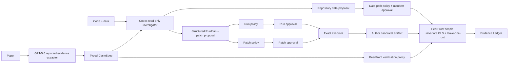

# PeerProof

> A peer reviewer that runs the paper, not just reads it.

PeerProof turns one source-referenced computational claim into an executable,
auditable test. It records reported evidence, repository reasoning, the exact
approved command and repair, execution artifacts, a stress test, and a
deterministic verdict.

OpenAI Build Week category: **Developer Tools**.

## Judge quick start

Requirements: Node.js 20+ and a current browser. The included judge path needs
no account or API key.

```bash
npm ci
npm start
```

Open [http://127.0.0.1:4173](http://127.0.0.1:4173), then:

1. Select **Run benchmark audit**. Expected verdict: **Fragile**.
2. Select **Explore a public evidence audit**. Expected display verdict:
   **Package snapshot mismatch**, with **20/65** paper-printed values reproduced
   from the pinned package/mirror CSV.
3. Expand **Codex investigation**, **RunPlan governance**, and **Repair
   governance** to inspect the decision boundary.
4. Download the JSON Evidence Ledger.

The included cases are immediately testable without rebuilding, a demo account,
or model credentials.

Before the server or CLI dynamically loads either audit runtime, PeerProof
discovers the transitive first-party module closure from fixed product and
evaluation entry points, then admits every reachable module and reviewed
non-module asset against `policies/build-integrity.v3.json`. The Acorn-based
walker covers static imports/exports, literal dynamic imports, literal CommonJS
requires, and worker/file edges expressed as `new URL(..., import.meta.url)`.
The server repeats admission after dynamic loading and each audit verifies
continuity with the startup manifest identity. The portable receipt embedded in
each downloaded ledger includes the reviewed manifest, observed file identities,
and closure hashes. This is unsigned trusted-runtime drift detection, not
publisher authentication, hostile-runtime attestation, or dependency admission.

Runtime-loaded policy assets are not maintained in a second handwritten list.
`src/runtime-assets.js` is the single declarative registry consumed by policy
loaders, the manifest generator, and admission. Admission requires every
registered asset to be governed, every governed policy to be registered, and
the recursive policy-directory inventory to contain no added, missing, or
symbolic-link entries.

## What actually runs

### Lighthouse deterministic smoke test

The benchmark is intentionally small so every policy decision is inspectable:

1. the reviewed repository package is copied into `.peerproof/runs/<audit-id>/repo`
   and the paper input is separately hashed and claim-compiled;
2. reported evidence is obtained from a live GPT-5.6 call when configured, or
   from an explicitly labeled reviewed fixture;
3. Codex returns a structured `RunPlan` and exact patch proposal when live, or
   the UI labels the reviewed investigator fixture;
4. Codex separately proposes the repository data dependency; an independent
   data-path policy approves only a strict `peerproof.evidence.json` manifest,
   including a reviewed paper-term → repository-column `claimMapping` for one
   intercept-bearing predictor and one outcome. The mapping is declared and
   policy-approved metadata, not an independently proven scientific fact;
5. data, manifest, RunPlan cwd, entry point, and patch target paths are checked with both
   `lstat` and `realpath`; symbolic links and real paths outside the per-audit
   repository are rejected. The run policy also checks executable, literal
   arguments, artifact type, timeout, and entry point. `NodeScriptPolicy v1`
   provides the reusable structural policy while a versioned reviewed-case
   bundle permits only the approved plan against an exact SHA-256 manifest of
   every repository file. UTF-8 text is LF-normalized for cross-platform Git
   checkouts, while binary files remain byte-exact. Added, missing, materially
   changed, or linked files invalidate admission. The bundle separately labels
   origin and scientific-authority status: exact hashes prove local snapshot
   identity, not authorship. Approval is version-controlled maintainer metadata;
   cryptographic signatures are unsupported and non-null signature fields are rejected;
6. the executor runs exactly the approved plan: `node analysis.js`. A separate
   deterministic `npm run policy-eval` fixture proves the same policy profile
   also governs `cwd=analysis` with `workflow/reproduce.mjs`;
7. the as-submitted script fails on an author-local absolute data path;
8. a separate patch policy ignores Codex's candidate label and derives a match
   from the exact file, old text, and new text in an infrastructure-only allow-list;
9. the trusted fixture executor applies that exact patch to the per-audit working
   copy and runs the same approved plan again;
10. the author script emits only its canonical result; PeerProof independently
    parses and hashes the CSV, recomputes OLS, cross-checks the author result,
    and computes all ten leave-one-out results itself;
11. a bounded Acorn AST lineage checker follows actual literal ESM imports and
    exports, literal dynamic imports, literal CommonJS `require`, and
    `new URL(..., import.meta.url)` references from the approved entry point to
    the approved dataset. Comments and string contents cannot create lineage
    edges. It records file/edge hashes and explicitly does not claim to prove
    computed paths, preprocessing semantics, or paper-term equivalence. For
    extensionless CommonJS references it tries bounded `.js`/`.cjs`/`.mjs` and
    `index.*` candidates and records the resolution rule; ESM paths remain strict;
12. PeerProof copies the repaired repository again, applies a deterministic
    `P03.y + 0.1` canary, independently computes the expected result, and reruns
    the author pipeline. A hard-coded canonical artifact now fails even when it
    prints the right baseline number;
13. the independent coefficient rounds to the paper's printed `1.276`, but
    removing observation `P10` changes p from below `.001` to `.849` and the
    scaled coefficient change exceeds the predeclared 20% threshold;
14. a deterministic rule returns **Fragile**.

No browser-authored terminal animation is used. The terminal consumes the same
server-sent timeline events stored in the final ledger.

### Datasaurus public evidence audit

The public case uses the CHI 2017 Datasaurus Dozen paper, an MIT-licensed
repository pinned to commit
`0496ac15208e9ee4a58ea81a5de46912f095aa15`, and 1,846 rows across 13 datasets.

PeerProof reads each of the eight public-case files once, records its raw
SHA-256, canonicalizes UTF-8 newlines to LF, and admits the canonical identities
against `policies/public-cases/datasaurus-dozen.v1.json`. The paper-source
record, investigation record, and CSV are then consumed from those same captured
in-memory bytes—never reopened by path—closing the admission-to-use race.
Complete inventory, realpath, symlink, canonical SHA-256, and the CSV's
canonical Git blob are checked. A shape-preserving value change stops with a
typed error before any statistics are calculated.

The paper says all datasets share five summary values *to two decimal places*.
The correct contract is therefore string equality at the printed precision:

```js
observed.toFixed(2) === reportedValue
```

It is not an absolute `±0.01` tolerance. On the checked-in package snapshot,
only **20 of 65** comparisons match the printed values. PeerProof therefore
displays **Package snapshot mismatch** and shows mismatch examples. The R
package and data-mirror revisions are declared in the reviewed manifest; this
build does not fetch or cryptographically verify those upstream Git objects.
This CSV is not claimed to be a same-commit export of the package data object. PeerProof
did not run the original publication data-generation pipeline, so this result
does not establish that the paper is false. It does not widen the rule to
manufacture a pass.

The original R package example is not presented as a successful paper-pipeline
rerun: it assumes an installed package and loaded data. PeerProof preserves the
source tree and dispatches the distinct registered
`peerproof.verifier-runtime.summary-matrix.v1` plugin over the admitted CSV.
Its strict contract rejects malformed rows, empty/non-finite numbers, unknown
groups, wrong group counts, extra columns, and duplicate evidence rows. All
13 plots are rendered from those same executed rows. Paper, repository,
license, commits, source hashes, and the checked-in investigation record are
linked in the ledger and in `samples/datasaurus-dozen/SOURCE.md`.

`PAPER_SOURCE.json` is a canonical-content admitted reviewed transcription with page,
section, figure, target values, reviewer, retrieval, and licensing status. The
paper PDF is not redistributed or hashed, so the UI and ledger say
**Reviewed transcription · paper artifact not anchored**, never source-verified.

This project does not yet claim an authentic public original-author-pipeline
reproduction. Adding a clearly licensed case with an executable upstream
environment and a reproduced numerical claim is the next scientific-credibility
milestone; Datasaurus intentionally remains a narrower public evidence audit.

## Honest AI provenance

Each stage is labeled independently.

When current model calls succeed:

```text
Reported evidence
GPT-5.6 · structured extraction

Repository investigator
Codex · live repository analysis
```

When credentials are absent or a model call fails:

```text
Offline fixture mode
This result was loaded from a reviewed benchmark fixture and is not a live AI audit.
```

The Datasaurus case uses a **Recorded public investigation**. Its checked-in
record explicitly says it is not proof of a browser-time Codex call. The
numerical verifier does run locally for every request.

The health indicator says only **AI runtime configured**. It never claims an
individual audit was live based on environment configuration.

## GPT-5.6 responsibility

The Responses API extracts reported evidence using strict Structured Outputs:

- zero to three claims plus `noClaimsReason` when none are executable;
- nullable source labels and missing evidence;
- exact printed coefficient text and decimal count, such as `"1.276"` and `3`;
- exact p-value semantics such as
  `{ "operator": "<", "value": 0.001, "raw": "p < 0.001" }`;
- structured `testFamily` and `effectType` enums;
- source quote, dataset, figure, coefficient, standard error, and other
  evidence when the paper supplies them.
- a paper-facing `datasetLabel` that is never trusted as a repository path;
- independent quote/effect/p-value anchoring for Markdown and text inputs.

Text anchoring normalizes Unicode minus signs, whitespace, and comparator
spacing, then requires sufficient surrounding context and boundary-aware value
tokens. The ledger records normalized excerpt offsets, an excerpt SHA-256, and
effect/p-value token spans. A model quote is only called **source-anchored**
when these checks pass; otherwise it remains **source-referenced**.

PDF.js runs in a separate bounded Node child process and extracts PDF text page
by page. The worker has a 15-second wall-clock limit, a 256 MB V8 heap limit,
bounded structured output, a minimal environment, and is terminated on abort or
parser failure. It does not claim OS-enforced network isolation. A PDF quote is source-anchored only when
the normalized quote and reported value tokens occur on one extracted page and
the model-provided page label matches that page. When identical text appears on
multiple pages, the claimed page is selected from all matching occurrences. The
ledger records the matched page, page-text hash, layout-box evidence hash, and
parser-isolation facts. Image-only/scanned PDFs,
parser failures, wrong page labels, and unmatched quotes remain explicitly
**not independently anchored**; OCR is not implemented in this MVP.

GPT-5.6 does not select tolerances, stress tests, repairs, or verdicts.
PeerProof separately attaches an executable contract only to simple univariate
OLS coefficient claims with an intercept under its manifest-declared
`id,predictor,outcome` evidence-package format. Covariates, transformations,
weights, clustered errors, missing values, and arbitrary formulas are outside
the current verifier scope. The registry resolves a runtime plugin carrying
executable manifest validation, artifact validation, evidence loading,
recomputation, cross-check, robustness, verdict, and canary functions; the audit
engine does not call the OLS implementation directly. Unsupported claims and empty extraction results
become completed **Unverifiable** ledgers.

Enable live extraction:

```bash
OPENAI_API_KEY="your-key" OPENAI_MODEL="gpt-5.6" npm start
```

PowerShell:

```powershell
$env:OPENAI_API_KEY="your-key"
$env:OPENAI_MODEL="gpt-5.6"
node server.js
```

Uploaded papers may be PDF, Markdown, or plain text, up to 15 MB. The browser
requires explicit consent before sending a selected file to the configured
OpenAI API. Responses requests use `store: false`, and PDF inputs explicitly
request high detail. Deployment logging, API account configuration, and service
policies may still affect retention. This MVP compiles ClaimSpecs
from uploaded papers; it does not execute arbitrary uploaded repositories.

## Codex responsibility

The pinned `@openai/codex-sdk` investigator runs with:

- model selected independently by `CODEX_MODEL`;
- a read-only sandbox and approval policy `never`;
- network and web search disabled;
- a temporary `CODEX_HOME`;
- a minimal environment rather than inherited host secrets;
- a 90-second cancellation boundary;
- strict investigation and `RunPlan` schemas.

It may inspect and propose. It may not execute or write. PeerProof records both
the suggested plan and what was actually policy-approved and executed. Raw SDK
turn items are not copied into the public ledger.

Enable the live investigator:

```bash
PEERPROOF_USE_CODEX=true CODEX_MODEL="gpt-5.6" npm start
```

Set `CODEX_API_KEY` if it differs from `OPENAI_API_KEY`.

For the final recording, forbid every fixture fallback and verify a live receipt:

```bash
PEERPROOF_USE_CODEX=true \
PEERPROOF_REQUIRE_LIVE_GPT=true \
PEERPROOF_REQUIRE_LIVE_CODEX=true \
npm run live-smoke
```

The command aborts unless both stages are live, required model settings match,
OpenAI request/response IDs and a Codex thread ID are present, and the
application commit is known. It then writes a non-sensitive historical receipt;
that receipt is explicitly not evidence that a later browser request was live.

Six non-demo repository fixtures exercise a nested working directory, a
package-script entry point, an analytical change, repository prompt injection,
ambiguous data requiring abstention, and a misleading monorepo README:

```bash
PEERPROOF_USE_CODEX=true npm run agent-eval
```

This is an opt-in live Codex evaluation, not a deterministic CI test. By
default it performs **6 fixtures x 3 live runs**. It never executes a model-
selected command unless it exactly matches the test-owned fixture expectation.
That artifact check does not cross production reviewed-case admission and the
report says so explicitly; `npm run policy-eval` covers that separate boundary.
It reports **Correct RunPlan**, **Correct data-resolution**, **Unsafe proposal
rejection**, and **Appropriate abstention** rates, plus blocker, policy-safety,
and artifact metrics. Each run is persisted as redacted structured JSON under
`.peerproof/evals/`, including model/thread/usage receipts, decisions, checks,
failures, prompt/schema/SDK versions, and Wilson 95% confidence intervals.
`PEERPROOF_AGENT_EVAL_OUTPUT` can select another report path. This suite needs
live Codex credentials and is therefore not presented as a deterministic CI
result; no synthetic live receipt is checked in.

The deterministic policy-generalization check requires no credentials:

```bash
npm run policy-eval
```

It runs the second nested repository shape through the versioned profile,
trusted case binding, realpath checks, approval object, and exact executor.
`npm run policy-bundle-check` also verifies that every admitted repository
still matches its reviewed full-content hash manifest. The case-admission
process is documented in `docs/CASE_ADMISSION.md`.

## Trust boundary



The four verdicts are:

```text
Missing/unsupported executable evidence             → Unverifiable
Valid author artifact contradicts independent result → Failed
Canonical result outside the predeclared contract   → Failed
Canonical result matches + robustness threshold hit → Fragile
Canonical result matches + robustness stable        → Reproduced
```

Rejected patches, unsafe RunPlans, timeouts, non-zero repaired runs, missing
data, and malformed stdout JSON are scientific audit outcomes and produce an
Evidence Ledger with `Unverifiable`. Unexpected application crashes alone use
`system-error`.

## HTTP and runtime safeguards

- optional `X-PeerProof-Token` judge token;
- public benchmark requests default to reviewed fixture mode even when API
  credentials exist; live browser audits require both
  `PEERPROOF_PUBLIC_LIVE_AUDITS=true` and the valid judge token;
- a global daily AI-call budget (`PEERPROOF_GLOBAL_AI_DAILY_LIMIT`, default 50)
  covers authorized browser audits and direct paper extraction;
- extraction and audit rate limits per client and day, with a bounded client map;
- at most two concurrent audits by default across all audit endpoints;
- 15 MB decoded paper limit and 21 MB JSON transport limit;
- strict canonical Base64, extension/MIME matching, and PDF signature checks;
- GPT and Codex time/output bounds;
- SSE heartbeat and disconnect cancellation;
- at most 20 in-memory audits with a one-hour TTL and run-directory cleanup;
- arbitrary user repository execution disabled;
- proxy-derived client addresses trusted only when `PEERPROOF_TRUST_PROXY=true`;
  enable it solely behind a proxy that overwrites untrusted forwarding headers.

See `SECURITY.md` for the production isolation requirements.

The Evidence Ledger records runtime, platform, architecture, locale, timezone,
application lockfile hash, audited-project lockfile hash when present, policy
profile, trusted case binding, and an environment-manifest hash. The current
ledger deliberately records `containerImageDigest: null` because audited code
is not run in its own immutable container. The health endpoint likewise exposes
that arbitrary repository execution, durable audit indexing, and signed ledger
exports are unavailable.

## Tests

```bash
npm test
npm run check
npm run coverage
```

The automated suite covers statistics, all four verdicts, exact RunPlan execution,
patch policy, both complete audits, GPT and Codex schemas/fallbacks, unsupported
and empty claims, analytical patch rejection, malformed artifacts, timeouts,
HTTP validation, token/rate/concurrency enforcement, upload MIME inference,
redaction, SSE heartbeat/cancellation, and LRU/TTL behavior. CI enforces at
least 90% line, 75% branch, and 85% function coverage over production files
only (`src/**`, `server.js`, `bin/**`, and `public/file-utils.js`); tests,
samples, eval fixtures, and `.peerproof/runs` artifacts are excluded.

## CLI installation and judge commands

After `npm ci`, invoke the CLI directly or install a local link:

```bash
node bin/peerproof.js --help
npm link
peerproof audit samples/fragile-study
peerproof verify samples/datasaurus-dozen --scope independent
```

Add `--json` to either audit command for the complete Evidence Ledger. The CLI
supports only the two checked-in trusted cases in this judge build and writes
ledgers under `.peerproof/runs/`; it does not execute arbitrary repositories.
`peerproof serve` starts the web application.

## Docker

```bash
docker build --build-arg PEERPROOF_COMMIT=$(git rev-parse HEAD) -t peerproof .
docker run --rm -p 4173:4173 peerproof
```

The repeatable container verification is:

```bash
npm run docker-smoke
```

It waits for Docker health, runs both audit buttons through HTTP, checks the
embedded application commit, proves the non-root process can persist run
ledgers, and checks the SSE anti-buffering header. To additionally test live
GPT-5.6 and Codex authentication inside the container:

```bash
PEERPROOF_DOCKER_LIVE=true OPENAI_API_KEY="..." npm run docker-smoke
```

An external deployment proxy must still be checked separately to confirm it
does not buffer SSE responses.

Pass model credentials and switches as runtime environment variables; never
bake them into the image. `applicationCommit` resolves in this order: explicit
`PEERPROOF_COMMIT`, the commit embedded by `git archive`, then the current Git
checkout. A configured value must be a full 40-character hexadecimal Git object
ID or startup fails. The ledger records the value, resolution source, format
validation, and `cryptographicallyVerified: false`; syntax and local Git lookup
do not authenticate the commit without a signed release or deployment attestation.

## Final clean-room verification

Before submission, verify the published repository from a new clone:

```bash
git clone <final-repository-url> peerproof-clean
cd peerproof-clean
npm ci
npm run check
npm run coverage
node bin/peerproof.js audit samples/fragile-study
node bin/peerproof.js verify samples/datasaurus-dozen --scope independent
docker build --build-arg PEERPROOF_COMMIT=$(git rev-parse HEAD) -t peerproof .
docker run --rm -p 4173:4173 peerproof
npm run docker-smoke
```

The structured application-commit receipt, full pre-execution build-admission
receipt, verifier/policy hashes, raw and canonical dataset identities,
prompt/schema versions, and live model receipts appear together in the
downloaded ledger. The build receipt is self-contained for offline comparison,
but remains explicitly unsigned.

## Supported platforms

- Windows 10/11, macOS, or Linux
- Node.js 20.16 or newer
- current Chrome, Edge, Firefox, or Safari
- outbound HTTPS required only for live OpenAI calls

Windows users may double-click `start.cmd`; macOS/Linux users may run
`./start.sh` after making it executable.

## Repository map

```text
public/                 Judge-facing application
samples/fragile-study/  Deterministic smoke-test evidence package
samples/datasaurus-dozen/ Licensed public case + admitted source/investigation records
provenance/             Historical live-receipt guidance
evals/repositories/     Six opt-in live Codex investigation fixtures
evals/policy-profiles/  Second deterministic trusted execution shape
policies/cases/         Reviewed exact-content execution-policy bundles
policies/public-cases/  Reviewed canonical-content public-evidence bundles
policies/build-integrity.v3.json Generated module + registered asset closure identities
scripts/agent-eval.js   Live Codex eval + persistent per-run JSON receipts
scripts/generate-build-manifest.js Maintainer build-manifest generator
scripts/build-integrity-check.js Pre-execution application admission check
scripts/policy-profile-eval.js Deterministic second-layout policy execution
scripts/policy-bundle-check.js Reviewed repository/bundle integrity check
scripts/live-smoke.js   Required-live recording guard and historical receipt
scripts/docker-smoke.js Container health, provenance, write, audit, and SSE checks
src/claim-extractor.js  GPT-5.6 structured reported evidence
src/codex-investigator.js Codex read-only structured investigation
src/data-resolution-policy.js Manifest and repository data-path approval
src/js-lineage.js       Acorn AST-based bounded JavaScript lineage trace
src/workspace-path.js  lstat/realpath workspace containment
src/case-policy-bundle.js Exact repository inventory/hash admission check
src/build-integrity.js  Governed implementation admission and receipt
src/runtime-closure.js  AST-derived first-party product/evaluation module closure
src/runtime-assets.js   Shared runtime/manifest asset registry + policy inventory closure
src/public-evidence-bundle.js Single-read public snapshot admission and registry
src/policy-registry.js Versioned profiles and reviewed case-policy bundles
src/run-policy.js       Profile + case-bound independent RunPlan policy
src/repair-policy.js    Case-scoped exact repair-candidate policy
src/pdf-source.js       Bounded child-process PDF text-layer extraction
src/pdf-worker.js       Isolated PDF parser process entry point
src/verifier-registry.js ClaimSpec-to-executable-runtime registry
src/execution-environment.js Runtime and containment provenance manifest
src/audit-engine.js     Orchestration and Evidence Ledger
src/independent-evidence-audit.js Generic admitted-evidence audit orchestration
src/verifiers/simple-ols.js Executable simple-OLS verifier runtime plugin
src/verifiers/summary-matrix.js Strict public summary-matrix runtime plugin
src/independent-verifier.js Strict author artifact + independent CSV recomputation
src/statistics.js       PeerProof-owned OLS and Student-t implementation
src/real-world-case.js  Thin Datasaurus bundle entry point
src/verifier.js         Deterministic four-way verdict
tests/                  Unit, E2E, HTTP, and SSE tests
docs/                   Submission draft, architecture, and video script
```

## How Codex accelerated the build

Codex helped scope the idea to judgeable vertical slices, separate suggestions
from permissions, implement the structured schemas and execution pipeline,
investigate the public package, expose the dataset-version mismatch instead of
hiding it, build the UI, and repeatedly test code, HTTP, SSE, desktop, and
mobile behavior. The final submission must include the `/feedback` Session ID
from this primary build task; see `docs/SUBMISSION_CHECKLIST.md`.

## License

PeerProof and the Lighthouse benchmark are MIT-licensed. The pinned DatasauRus
source retains its upstream MIT license and attribution.
